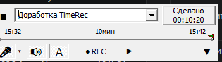

# TimeRec

Лёгкий трекер времени для Windows. Один EXE, без установщика, без внешних зависимостей. Поддерживает запись сопровождающего аудио (микрофон и/или системный звук) с автопаузой при тишине и **локальной расшифровкой в текст через whisper.cpp** (полностью офлайн).

   



## Установка

Скачать готовый билд из раздела [Releases](../../releases) → положить `TimeRec_v5.exe` в любую папку → запустить. Папки `data/` и `audio/` создаются рядом с EXE автоматически.

## Возможности

### Учёт времени

- Таймер запускается автоматически, идёт непрерывно — нет режима «Стоп».
- Кнопка «Сделано» фиксирует текущий сегмент в журнал дня и стартует следующий.
- Финишный флажок на полосе времени можно тащить влево, укорачивая длительность задним числом («забыл переключить»).
- Поиск задачи по подстроке с двух символов, многословный, без учёта порядка слов.
- История задач сортируется по последнему использованию.

### Запись аудио

- Микрофон и/или системный звук (то, что играет в системе), в один непрерывный MP3-файл.
- **Горячее вкл/выкл источников во время записи** — выключенный источник заменяется тишиной (как в Bandicam/OBS).
- Автопауза при тишине — паузы автоматически вырезаются. Порог калибруется под каждый микрофон автоматически.
- CBR-кодирование — файлы точно seek'аются по позиции.
- Качество настраивается в меню: 64 / 128 / 256 kbps, моно/стерео, 16 / 22 / 44 / 48 кГц.
- Список записанных файлов: воспроизведение, переименование, удаление, открытие папки с файлом, копирование пути. Каждый файл помнит, к какой задаче он относится.

### Расшифровка аудио в текст (v5)

- Локальный whisper.cpp — полностью офлайн, никаких облачных API.
- Меню → «Расшифровка аудио (Whisper)…»: скачать движок и модель прямо из настроек.
- Поддерживает **CPU**, **CPU+BLAS**, **CUDA** (NVIDIA). Для **AMD GPU** к релизу прилагается готовая Vulkan-сборка.
- Модели на выбор: tiny / base / small / medium / large-v3-turbo. По умолчанию — large-v3-turbo (~870 МБ, лучшее соотношение скорости и качества для русского).
- Кнопка **T** на главном окне → расшифровать последнюю запись. Когда расшифровка есть → кнопка **Aa** открывает её. Ctrl+клик — перетранскрибировать.
- В списке аудио — столбец «Расш.» с теми же действиями для любого файла.
- Окно просмотра — таблица «Время | Текст»:
  - Колонка времени переключается (скрыть/показать).
  - Текст редактируется прямо в таблице, сохраняется обратно в `.txt`.
  - Встроенное воспроизведение (▶/■ + клик по времени → seek на позицию).
  - Подсветка текущей строки во время воспроизведения, автопрокрутка.
- Фильтр галлюцинаций Whisper (типичные «Субтитры сделал DimaTorzok», «Thanks for watching!», и др.).

### Статистика

- Периоды: Сегодня / Вчера / Неделя / Месяц / Произвольный.
- Фильтры по задачам и по виду (kind), режим «исключить» для скрытия категорий.
- Табличный и текстовый вид, копирование в буфер.
- Округление минут до ближайших 5 ↑ (опция в текстовом виде).
- Прозрачная интеграция с журналами LazyCure (`.timelog`), если указать его папку.

### Окно

- Borderless, всегда поверх (опционально), drag за любое место, resize по краям с сохранением пропорций.
- Прозрачность по слайдеру.
- «Скрыть из панели задач» — окно остаётся видимым, но не появляется в Taskbar / Alt+Tab.
- Все настройки (позиция, размер, прозрачность, top-most, скрытие из таскбара) сохраняются автоматически.

## Хранение данных

Всё рядом с EXE:

- `data/YYYY-MM-DD.xml` — дневной журнал событий.
- `data/tasks.xml` — справочник задач и их видов.
- `audio/TimeRec_YYYYMMDD_HHNNSS.mp3` — аудиозаписи.
- `audio/TimeRec_YYYYMMDD_HHNNSS.txt` — расшифровки (рядом с MP3-файлом).
- `config.xml` — настройки.
- `whisper.cfg` — настройки расшифровки.
- `current.xml` — маркер незакрытой задачи (при аварийном завершении следующий запуск автоматически дописывает её, теряется максимум 10 секунд).
- `whisper/` — движок whisper.cpp (whisper-cli.exe + DLL).
- `models/` — модели Whisper (`ggml-*.bin`).

## Сборка из исходников

Требуется [Lazarus 4.2](https://www.lazarus-ide.org/) + Free Pascal 3.2.2 (входит в инсталлятор).

```cmd
lazbuild --build-mode=Release TimeRec.lpi
```

Результат — `bin\TimeRec_v5.exe`. Скрипт `pack.cmd` (вызывается lazarus автоматически после сборки) дополнительно упаковывает EXE через UPX.

`ffmpeg.exe` (минимальная сборка) встроен в EXE как RCDATA-ресурс и извлекается рядом с программой при первом запуске.

## История версий

- **v5** — локальная расшифровка аудио в текст через whisper.cpp (CPU / CUDA / Vulkan-AMD), встроенный плеер с подсветкой текущей строки, точный CBR-seek для MP3, редактируемая таблица расшифровки.
- **v4** — горячее переключение mic/sys во время записи, префикс `TimeRec_` в именах файлов, контекстное меню в списке аудио (копировать путь, открыть папку), округление минут в статистике, контекстные подсказки.
- **v3** — запись звука с автопаузой при тишине, список записей со ссылками на задачи, поставка одним файлом.
- **v2** — статистика, редактор журналов, прозрачность, скрытие из панели задач, отрисовка флажка на полосе времени.

## О разработке

Язык: Object Pascal (Free Pascal 3.2.2). Среда: Lazarus 4.2. Программа разработана в диалоге с ИИ-ассистентом **Claude Opus 4.7 (Anthropic)** — практически весь код написан вместе с ним.

Начало реализации: 21 мая 2026 года.

## Идейный предок

Проект сделан по следам утилиты [LazyCure](https://github.com/vitalliuss/lazycure) — модель «таймер всегда идёт, кнопка «Сделано» переключает задачу, ничего вручную не стартуешь» взята оттуда. TimeRec умеет прозрачно читать её журналы (`*.timelog`) — достаточно указать папку LazyCure в меню, и события из неё включаются в статистику наравне с собственными.

## Лицензия

MIT — см. [LICENSE](LICENSE).
